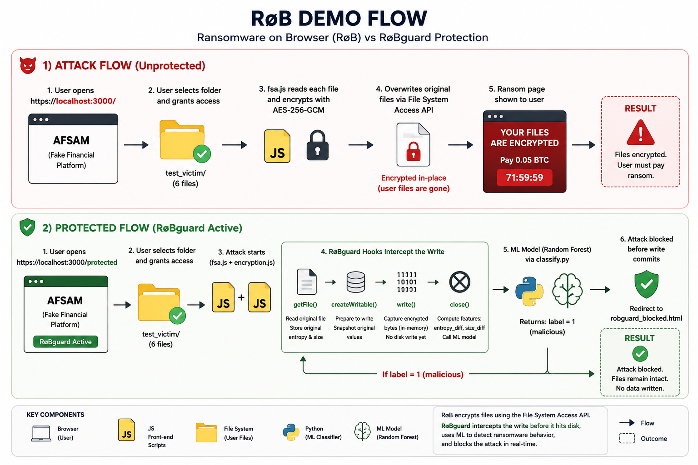

# Ransomware on Browser Defense — Demo Project

This project demonstrates the **RøB (Ransomware over Browser)** attack and its
countermeasure **RøBguard**, which uses ML-based FSA API hooking to detect and
block ransomware encryption in real-time.

## Demo Workflow

<p align="center">
  
</p>

*Figure 1. Overall workflow of the RøB attack and RøBguard protection mechanism.*

---

## Project Structure

```
Soucre Code/
├── README.md           ← this file
├── docs/
│   ├── demo_guide.md               ← step-by-step presenter instructions
│   ├── project_map.md              ← full file tree, routes, demo flows
│   └── robguard_detection_workflow.png
├── models/             ← put downloaded .pkl files here (see notebooks/)
├── notebooks/
│   ├── ransomware_detection.ipynb          ← main Colab notebook (source)
│   ├── ransomware_detection_runned_1.ipynb ← training attempt 1 (with outputs)
│   └── ransomware_detection_runned_2.ipynb ← training attempt 2 (with outputs)
├── references/
│   └── usenixsecurity23-oz.pdf ← Oz et al. (USENIX Security 2023) — study reference
├── test_victim/        ← demo folder; run generate.py to (re)create victim files
└── RoB/                ← HTTPS server + both demo frontends
    ├── backend/
    │   ├── server.js       ← Node.js HTTPS server (port 3000)
    │   └── classify.py     ← Python classifier called by RøBguard
    └── public/
        ├── main.html               ← Demo 1: unprotected AFSAM page
        ├── main_protected.html     ← Demo 2: RøBguard-protected page
        ├── robguard_blocked.html   ← Shown when ransomware is blocked
        ├── extortion.html          ← Ransom note page (Demo 1 end)
        └── js/
            ├── fsa.js          ← Attack: File System Access API encryption
            ├── encryption.js   ← AES-256-GCM implementation
            ├── extortion.js    ← Ransom page logic
            └── robguard.js     ← RøBguard: FSA hooks + entropy + ML call
```

---

## Components

| Component | Path | Purpose |
|-----------|------|---------|
| RøB Server | `RoB/backend/server.js` | Hosts both demos on `https://localhost:3000` |
| Attack page | `RoB/public/main.html` | Demo 1 — unprotected AFSAM |
| Protected page | `RoB/public/main_protected.html` | Demo 2 — RøBguard active |
| RøBguard hook | `RoB/public/js/robguard.js` | FSA API interception + entropy + ML call |
| ML Classifier | `RoB/backend/classify.py` | Loads best model, returns 0 (benign) or 1 (malicious) |
| Blocked page | `RoB/public/robguard_blocked.html` | Visual alert after attack is stopped |
| Models | `models/` | best_model.pkl + scaler.pkl — **download from Colab first** |
| Colab Notebook | `notebooks/ransomware_detection.ipynb` | Full ML training pipeline |
| Training records | `notebooks/ransomware_detection_runned_*.ipynb` | Actual Colab runs with outputs |

---

## How the Demo Works

### Demo 1 — Attack (unprotected)
`https://localhost:3000/`

The user visits what looks like a legitimate financial platform. When they grant
folder access, the site uses the **File System Access API** to encrypt all files
with AES-256-GCM. The user sees a ransom page demanding 0.05 BTC.

### Demo 2 — Defense (RøBguard)
`https://localhost:3000/protected`

Identical site, but **RøBguard hooks** are injected before any page script runs.
When the attack tries to write an encrypted file, the hook intercepts the
`write()` call — before any ciphertext reaches disk — computes the entropy
change and size change, and calls the trained ML model. The model returns
`label=1` (malicious). The write is **abandoned** and the user is redirected
to the blocked page — files untouched.

### ML Training (Google Colab)
`notebooks/ransomware_detection.ipynb`

The notebook generates synthetic file variants, extracts entropy/size features,
trains and evaluates all four models (RF, DT, KNN, XGBoost) with 10-fold CV,
selects the best model from actual results, and exports the model files for
download. Two completed training runs with full outputs are kept in
`notebooks/ransomware_detection_runned_1.ipynb` and `_runned_2.ipynb` for
reference.

---

## Quick Start

See **[`docs/demo_guide.md`](docs/demo_guide.md)** for complete setup and demo instructions.
For the full file tree, server routes, and demo flow diagrams see **[`docs/project_map.md`](docs/project_map.md)**.

---

## References

- **Oz, H., Aris, A., Levi, A., & Uluagac, A. S. (2023).** *A Survey on Ransomware: Evolution, Taxonomy, and Defense Solutions.*
  USENIX Security 2023. [`references/usenixsecurity23-oz.pdf`](references/usenixsecurity23-oz.pdf)

  Used as the primary study reference for the RøB attack model (browser-based ransomware via the File System Access API) and the RøBguard defense design.
